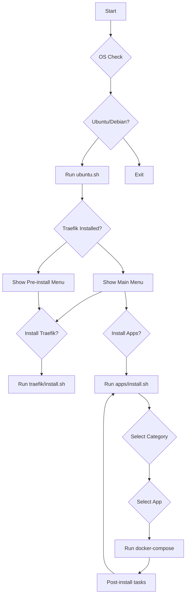
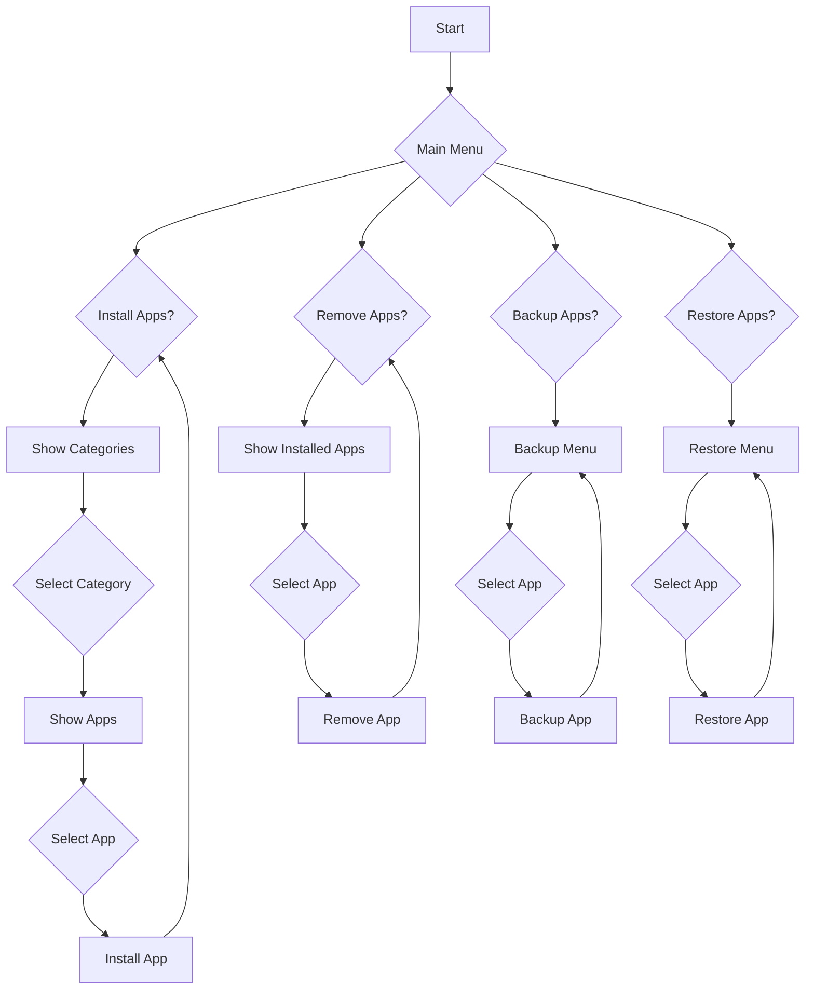

# Mermaid Charts

## Installation Flowchart

```mermaid
graph TD
    A[Start] --> B{OS Check};
    B --> C{Ubuntu/Debian?};
    C --> D[Run ubuntu.sh];
    D --> E{Traefik Installed?};
    E --> F[Show Main Menu];
    F --> G{Install Traefik?};
    G --> H[Run traefik/install.sh];
    F --> I{Install Apps?};
    I --> J[Run apps/install.sh];
    J --> K{Select Category};
    K --> L{Select App};
    L --> M[Run docker-compose];
    M --> N[Post-install tasks];
    N --> J;
    C --> O[Exit];
    E --> P[Show Pre-install Menu];
    P --> G;
```

## Application Management Flowchart

```mermaid
graph TD
    A[Start] --> B{Main Menu};
    B --> C{Install Apps?};
    C --> D[Show Categories];
    D --> E{Select Category};
    E --> F[Show Apps];
    F --> G{Select App};
    G --> H[Install App];
    H --> C;
    B --> I{Remove Apps?};
    I --> J[Show Installed Apps];
    J --> K{Select App};
    K --> L[Remove App];
    L --> I;
    B --> M{Backup Apps?};
    M --> N[Backup Menu];
    N --> O{Select App};
    O --> P[Backup App];
    P --> N;
    B --> Q{Restore Apps?};
    Q --> R[Restore Menu];
    R --> S{Select App};
    S --> T[Restore App];
    T --> R;
```
